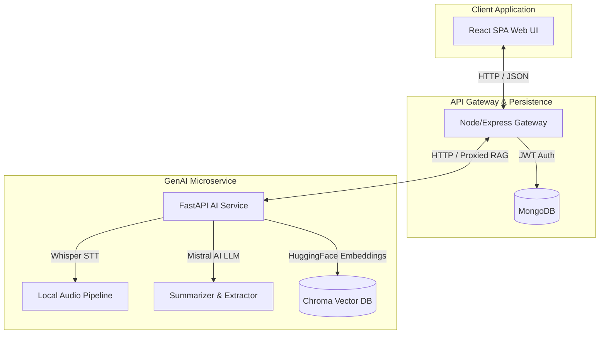

# 🎬 AI Video Assistant (MERN + FastAPI + LangChain RAG)

An intelligent, enterprise-grade meeting analysis and QA assistant. The project is split into a modular microservices architecture featuring a React SPA, an Express Gateway, and a FastAPI AI processing pipeline.

The pipeline ingests YouTube URLs or local media files, performs transcription (via local Whisper or translated APIs), summarizes the session, extracts meeting minutes (action items, decisions, questions), and stores embeddings in a Chroma DB vector database, allowing real-time retrieval-augmented conversations (RAG) per video report.

---

## 🏗️ System Architecture & Services

The application is structured into three primary modules:

1.  **Frontend (`/frontend`)**: A React SPA styled with Tailwind CSS v4, managing user accounts, reports dashboards, interactive summaries, checklist components, and instant chat conversations.
2.  **Backend (`/backend`)**: A Node.js + Express gateway server utilizing MongoDB for metadata, user credentials (JWT), chat logs, and usage metrics. It proxies pipeline and chat questions to the AI Service.
3.  **AI Service (`/ai-service`)**: A FastAPI microservice running the transcription, analysis, and LangChain/Chroma vector DB RAG pipeline.



---

## 🚀 Key Features

*   **Universal Input Ingestion**: Ingests online YouTube videos or local media files (`.mp4`, `.mp3`, `.wav`, etc.).
*   **Dynamic Vector DB Partitioning**: Creates separate Chroma vector database collections per video analysis (`analysis_${id}`), isolating chat logs for separate meetings.
*   **Speech-to-Text (STT)**: Employs local OpenAI Whisper models to execute high-fidelity local transcriptions.
*   **Structured LLM Extraction**: Leverages Mistral AI to extract:
    *   Professional meeting summaries.
    *   Interactive checkbox action items.
    *   Key decisions made during the session.
    *   Open questions and topics for follow-ups.
*   **MERN Persistent Storage**: Stores users, processed report structures, chat session history, and messages permanently in MongoDB.
*   **RAG Meeting Chatbot**: Retrieves semantic segments using `all-MiniLM-L6-v2` embeddings, answering follow-up queries inside the React Chat UI.

---

## 🛠️ Getting Started

### 1. Prerequisites
Ensure you have **FFmpeg** installed (required for processing audio formats):
- **Windows**: `winget install Gyan.FFmpeg`
- **macOS**: `brew install ffmpeg`
- **Linux**: `sudo apt install ffmpeg`

Make sure you have **Node.js (v18+)**, **Python (3.10+)**, and **MongoDB** running.

---

### 2. Environment Setup

#### AI Service (`/ai-service/.env`)
```env
MISTRAL_API_KEY=your_mistral_api_key_here
SARVAM_API_KEY=your_sarvam_api_key_here
WHISPER_MODEL=small
```

#### Express Backend (`/backend/.env`)
```env
PORT=5000
MONGO_URI=mongodb://localhost:27017/ai-video-assistant
JWT_SECRET=your_jwt_secret_key
AI_SERVICE_URL=http://localhost:8000
```

---

### 3. Installation & Run Guide

#### Run the AI Service (FastAPI)
```bash
cd AI_Service
python -m venv .venv
# Windows: .venv\Scripts\activate
# macOS/Linux: source .venv/bin/activate
pip install -r requirements.txt
python -m uvicorn app:app --reload
```
API docs will be available at `http://localhost:8000/docs`.

#### Run the Express Backend (Node)
```bash
cd Backend
npm install
npm run dev
```
The gateway will run on `http://localhost:5000`.

#### Run the Frontend (React)
```bash
cd Frontend
npm install
npm run dev
```
The user interface will run on `http://localhost:5173`.

---

## 🔒 Security & Git Configuration

Sensitive configurations, environment files (`.env`), database cache files (`vector_db/`, `chroma_db/`), and dependency folders (`node_modules/`, `.venv/`) are excluded from repository tracking via the root `.gitignore` file. Always copy the `.env.example` templates and populate them locally.
